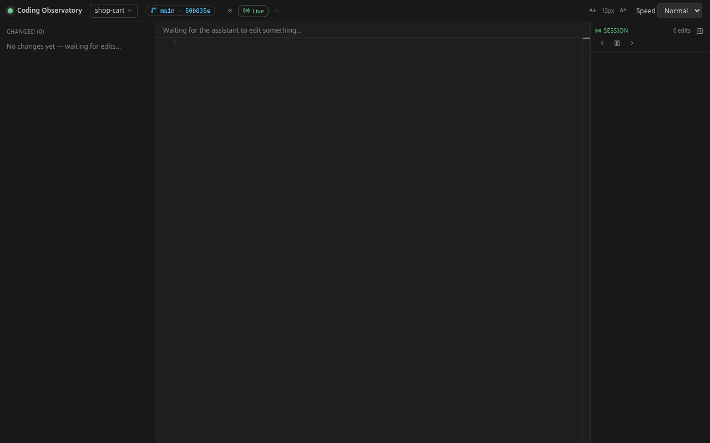
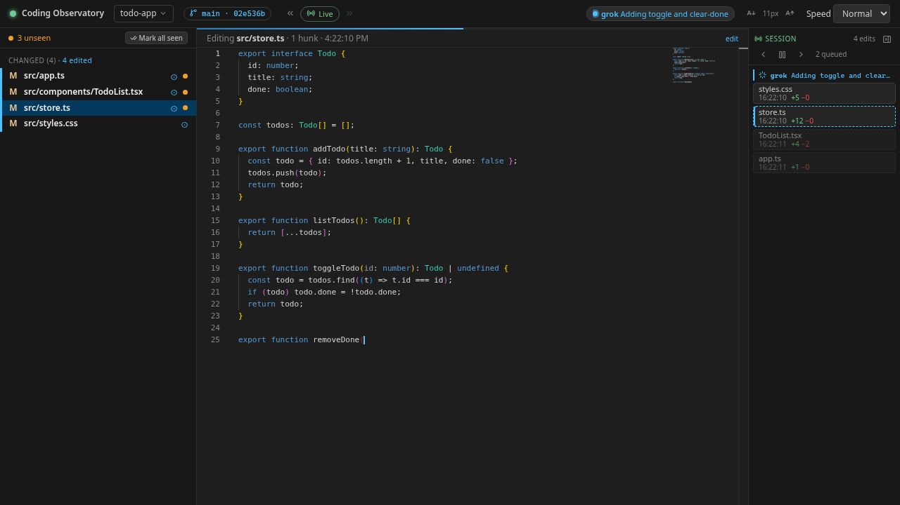
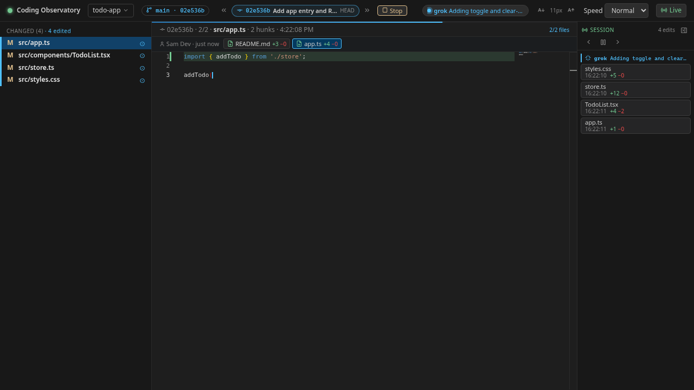

# grok-coding-observatory

**Watch your AI coding assistant's (for example Grok Bot's) edits replay live in your browser, file by file.**

Website: <https://observatory.eeliyarasta.com/>



Point it at the repo your assistant is working in, keep the tab open beside the chat, and every
save shows up as a short replay: it jumps to the changed lines, highlights the removed ones and
types the new code. It runs locally, needs no build step and reads your repo only through git and
the file system.

## Requirements

- **Node.js 22.6+** (it runs TypeScript directly; `nvm use` picks the version from `.nvmrc`)
- **git** on your `PATH`; the folder you watch must be inside a git work tree
- A modern browser with internet access (Monaco and the Lucide icon font load from jsDelivr)

## Quick start

In the folder of the repo your assistant is working in, run:

```bash
npx github:Eeliya/grok-coding-observatory
```

and open **<http://localhost:4477>**. That's it: no clone, no install step (npx asks once before
downloading). To watch another folder, add its path:
`npx github:Eeliya/grok-coding-observatory /path/to/your/repo`.

Or clone it (handy if you want to hack on it):

```bash
git clone https://github.com/Eeliya/grok-coding-observatory.git
cd grok-coding-observatory
npm install
npm start                          # then pick a repo in the browser
# or
npm start -- /path/to/your/repo    # watch that repo right away
```

With `npm start` the last repo you watched is remembered for the next start.

- **macOS / Linux:** run the commands in a terminal and open the URL in any browser.
- **Windows:** run it **inside WSL** (Ubuntu etc.), next to your repos, and open
  <http://localhost:4477> in your Windows browser (WSL forwards localhost). Keep your repos in the
  WSL file system (`~/…`) for instant file events; repos under `/mnt/c/…` work too but are polled.

## Using it

| Area                       | What it does                                                                                                                                                                                                                                                                                                                                                                                                                                 |
| -------------------------- | -------------------------------------------------------------------------------------------------------------------------------------------------------------------------------------------------------------------------------------------------------------------------------------------------------------------------------------------------------------------------------------------------------------------------------------------- |
| **Live view**              | Each saved change is replayed in order (nothing is dropped). Big changes, lock files and generated files appear instantly; a backlog fast-forwards. The thin bar under the header shows playback progress.                                                                                                                                                                                                                                   |
| **Sidebar**                | Files that differ from `HEAD`, split into Changed and Untracked (git-ignored files never show). Click a file for a side-by-side diff vs `HEAD`.                                                                                                                                                                                                                                                                                              |
| **Unseen dots**            | An orange dot marks files that changed since you last looked (played back or opened). **Mark all seen** clears them; the diff view can also show **since last look**. Stored per repo in your browser.                                                                                                                                                                                                                                       |
| **Timeline**               | The **Session** bar on the right lists this session's uncommitted edits, oldest at the top and newest at the bottom (it scrolls to follow), with time and +/− lines. Click one to replay exactly that edit. Commit and branch-switch markers are clickable; agent status changes show as markers too. Collapse it to a slim strip with the panel button (remembered). Kept on the server, so a refresh keeps it.                             |
| **Pause / step**           | Pause live playback (new edits wait, with a count), then step through edits one at a time with ‹ / ›.                                                                                                                                                                                                                                                                                                                                        |
| **Commits**                | The header shows the mode: **Live**, or the sha, subject and `HEAD~n` of a commit. « / » walk the current branch's history (first-parent); a commit plays back file by file with **Play / Stop**, or click a file for its diff. » on the newest commit returns to live.                                                                                                                                                                      |
| **Agent status**           | Optional chip in the header per agent that reports via [docs/AGENT-PROTOCOL.md](docs/AGENT-PROTOCOL.md): working (pulsing dot + message), done (✓ summary · age), possibly stalled, idle. Also prefixes the tab title (⏳ / ✓ / ⚠); click it for recent activity.                                                                                                                                                                            |
| **Agent plan & questions** | Optional, same protocol: the agent publishes its plan and the Session timeline shows it as a checklist (current step highlighted, "1/4 done"); each edit is labelled with the step that was current, and clicking a step highlights its edits. Questions for you appear as cards above the editor (blocking ones stand out, with options, "asked 3m ago" and a Copy button) and as a badge on the status chip until the agent resolves them. |
| **Controls**               | Header: repo picker (recent repos, repos found under `~/work`, or any path), A− / A+ code font size (8–20 px), and playback speed (Slow … Instant). All remembered.                                                                                                                                                                                                                                                                          |





### Keyboard shortcuts

| Key                                | Action                                                                        |
| ---------------------------------- | ----------------------------------------------------------------------------- |
| `Space`                            | Pause / resume live playback                                                  |
| `←` / `→`                          | Previous / next edit in the timeline (`→` while paused plays the next queued) |
| `[` / `]` or `Shift+←` / `Shift+→` | Older / newer commit (newer from the newest commit returns to live)           |
| `Esc`                              | Close the picker → back to live from a diff, replay or commit → resume        |

Shortcuts are ignored while you type in an input.

## Using it with Grok Bot

1. Start the observatory where your repos live (on Windows: in WSL) and open <http://localhost:4477>.
2. Pick the repo your assistant is editing (click the repo name in the header, or start it with
   `npx github:Eeliya/grok-coding-observatory ~/work/my-project`).
3. Keep the tab open beside the chat. Each edit replays as it lands; when you come back, the dots
   and the timeline show what changed while you were away, and « walks through the commits it made.
4. Optional: let the agent report whether it is **busy or done** (also while it only runs lint,
   tests or git). Tell it:

   > Follow docs/AGENT-PROTOCOL.md in grok-coding-observatory to report your status.

   It then writes a small JSON file into the repo's git dir (never committed), and the header shows
   a chip per agent: a pulsing dot with what it is doing, ✓ **Done · summary · 2m ago**, or
   **possibly stalled** if it stops refreshing. See **[docs/AGENT-PROTOCOL.md](docs/AGENT-PROTOCOL.md)**
   for the path, schema, and bash / PowerShell / Node one-liners.

   For longer tasks the agent can also publish its **plan** (a checklist with the current step,
   and every edit labelled with its step) and **ask you questions** that stay highlighted until it
   resolves them. Add to your `AGENTS.md` / `CLAUDE.md` / Cursor rule:

   > For multi-step tasks, also publish your plan, keep the current step up to date and put
   > questions for me in the same status file (`plan`, `step`, `questions`), as described in
   > docs/AGENT-PROTOCOL.md of grok-coding-observatory. Mark each step done or skipped when you
   > finish it (working out of order is fine). Still ask the question in the chat.

   The bundled CLI does the bookkeeping: `plan set`, `step start 2`, `ask … --blocking`,
   `resolve q1` (see the protocol).

It is local-only: the server binds to `127.0.0.1`, reads your repo via git and the file system, and
never sends your code anywhere (the page only fetches Monaco and the icon font from a CDN). It never
writes to your work tree and never takes git locks; the only thing it creates is the agent status
folder `.git/observatory/status/` inside the git dir.

## Configuration

Everything is optional. Set variables in the environment or copy `.env.sample` to `.env`.

| Variable                 | Default                             | Description                                                       |
| ------------------------ | ----------------------------------- | ----------------------------------------------------------------- |
| `PORT`                   | `4477`                              | HTTP / WebSocket port                                             |
| `HOST`                   | `127.0.0.1`                         | Interface to bind (`0.0.0.0` exposes it on your network)          |
| `TARGET_DIR`             | –                                   | Repo to watch at start (a CLI path wins)                          |
| `REPOS_ROOT`             | `~/work`                            | Folder scanned (two levels deep) for repos in the picker          |
| `OBSERVATORY_CONFIG_DIR` | `~/.config/grok-coding-observatory` | Where the last-used and recent repos are stored                   |
| `WATCH_POLL`             | auto                                | `1` = poll for changes, `0` = native events (auto polls `/mnt/…`) |

## Troubleshooting

- **"Port 4477 … is already in use"** – another copy is running (just open the URL), or start on
  another port: `PORT=4478 npm start`. To find the old one on Linux/WSL:
  `ss -ltnp 'sport = :4477'` (then `kill <pid>`).
- **"Not a git work tree"** – the folder must be inside a git repo (`git init` it, or pick the
  repo root). The picker shows the exact error.
- **"needs Node.js 22.6 or newer"** – install a newer Node (`nvm install 22 && nvm use`).
- **Edits don't show up (WSL)** – for repos on a Windows drive (`/mnt/c/…`) changes are polled,
  which is slower; move the repo into WSL (`~/…`) or force it with `WATCH_POLL=1`. On Linux with
  very large repos, raise `fs.inotify.max_user_watches`.
- **Blank editor** – the browser needs to reach `cdn.jsdelivr.net` for Monaco.

## Development

Contributions are welcome: see [CONTRIBUTING.md](CONTRIBUTING.md) (fork, branch, pull request).

```bash
npm run check   # typecheck + prettier check + tests (node:test, temp git repos, real server)
npm test        # tests only
npm run format  # prettier --write .
```

To re-record the demo GIF at the top: `npm i --no-save puppeteer-core && node scripts/record-demo.mjs`
(needs Chrome and ffmpeg; gifski optional; writes `demo-out/`, then copy `demo.gif` to `docs/`).

How it's built: `src/server.ts` (HTTP + WebSocket, repo switching), `src/session.ts` (chokidar
watcher, per-file snapshots, HEAD tracking, line diffs via `src/hunks.ts`), `src/commits.ts`
(read-only branch history), `src/repos.ts` (repo validation, recent repos), `src/status.ts` (agent
status files) `bin/status.mjs` (status CLI) and `bin/observatory.mjs` (the `npx` launcher); `public/` is a single
static page (vanilla JS modules + Monaco) with the replay logic in `public/replay.js` and the
instant-playback thresholds in `public/playback-policy.js`.

## Reference

The HTTP and WebSocket API (used by the page, handy for scripting) is described in
[docs/API.md](docs/API.md); the agent status protocol in [docs/AGENT-PROTOCOL.md](docs/AGENT-PROTOCOL.md).

## License

[MIT](LICENSE)
